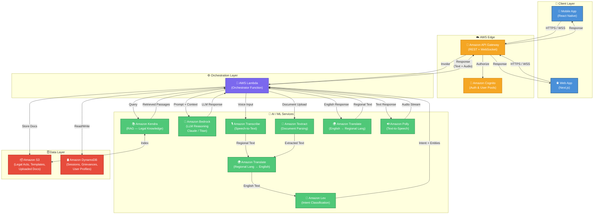
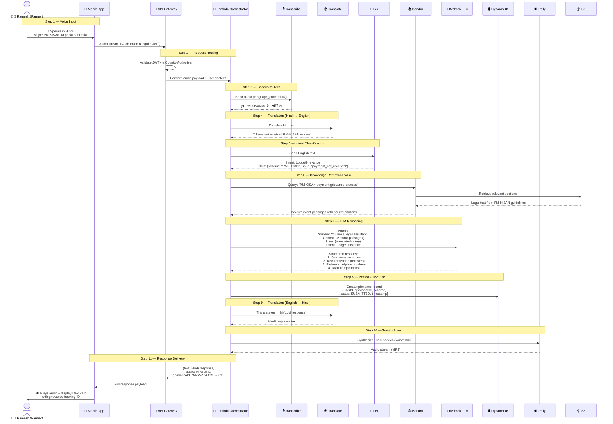
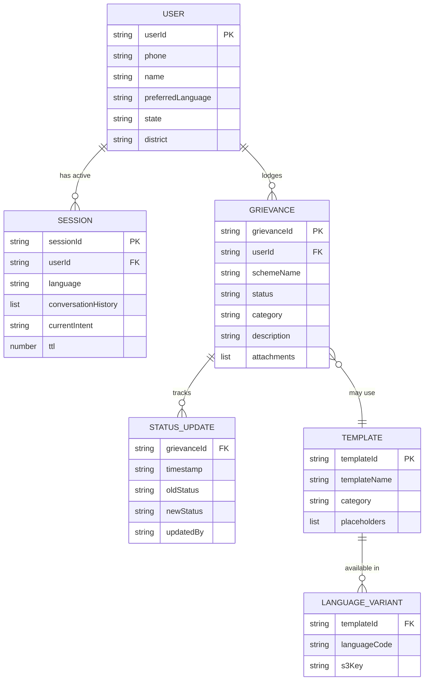
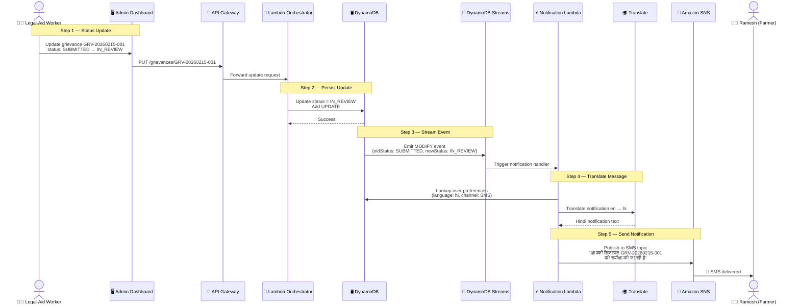
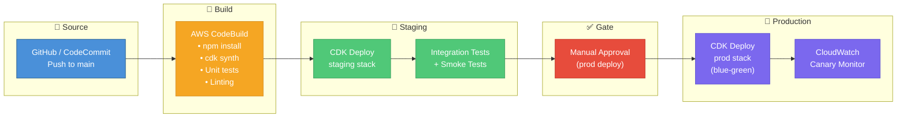

# Nyaya Mitra AI — Cloud Architecture Design Document

> **Version:** 1.0 · **Date:** 2026-02-15 · **Author:** Cloud Solutions Architect  
> A cloud-native, multilingual legal assistant that empowers rural citizens to understand their legal rights, lodge grievances, and navigate government schemes — in their own language and voice.

---

## Table of Contents

1. [System Architecture Overview](#1-system-architecture-overview)
2. [Architecture Diagram (Mermaid.js)](#2-architecture-diagram-mermaidjs)
3. [Component Breakdown](#3-component-breakdown)
4. [Data Flow — Use Case](#4-data-flow--use-case)
5. [Database Schema (DynamoDB)](#5-database-schema-dynamodb)
6. [Grievance Notification Flow](#6-grievance-notification-flow)
7. [Cost Estimation](#7-cost-estimation)
8. [Infrastructure as Code & CI/CD](#8-infrastructure-as-code--cicd)

---

## 1. System Architecture Overview

Nyaya Mitra AI follows a **serverless, event-driven** architecture on AWS, designed for cost-efficiency, elastic scaling, and low operational overhead — ideal for a public-facing legal-aid platform.

### High-Level Flow

```
User (Voice/Text) ──► API Gateway ──► Lambda Orchestrator ──► AI/ML Services ──► Response
```

| Layer | Responsibility |
|---|---|
| **Client Layer** | Mobile app (React Native / Flutter) and responsive web app deliver chat, voice, and document-upload interfaces. |
| **API Layer** | Amazon API Gateway (REST/WebSocket) handles authentication (Cognito), rate-limiting, and request routing. |
| **Orchestration Layer** | An AWS Lambda function acts as the central orchestrator — coordinating calls to language, reasoning, and retrieval services. |
| **AI / ML Layer** | Amazon Transcribe, Translate, Lex, Bedrock, Kendra, Textract, and Polly each handle a specialized role in the pipeline. |
| **Data Layer** | Amazon S3 stores legal documents and templates. Amazon DynamoDB persists user sessions, grievance records, and metadata. Amazon Kendra indexes S3 for semantic search (RAG). |
| **Security & Observability** | Amazon Cognito for auth, AWS WAF on API Gateway, CloudWatch + X-Ray for logging/tracing, and KMS for encryption at rest. |

### Key Design Principles

- **Multilingual-first** — Every interaction passes through Translate; the LLM reasons in English and responses are rendered in the user's language.
- **Voice-first rural UX** — Transcribe + Polly ensure illiterate users can interact entirely through speech.
- **RAG-grounded answers** — Bedrock LLM responses are always grounded in retrieved legal passages from Kendra, reducing hallucination.
- **Stateless compute** — Lambda functions carry no state; all session context is stored in DynamoDB.

---

## 2. Architecture Diagram (Mermaid.js)



---

## 3. Component Breakdown

| # | AWS Service | Role in Nyaya Mitra AI |
|---|---|---|
| 1 | **Amazon API Gateway** | Front-door for all client requests. Provides REST endpoints for text/document interactions and WebSocket endpoints for real-time voice streaming. Integrates with Cognito authorizers and WAF for security. Enforces rate limiting and throttling to prevent abuse. |
| 2 | **Amazon Cognito** | Manages the full authentication lifecycle: (a) **User Pools** — phone-number-based OTP sign-up/sign-in for rural users without email, (b) **JWT tokens** — issues ID/Access/Refresh tokens for stateless API auth, (c) **Role-based access** — three groups: `citizen`, `legal-aid-partner`, `admin` with scoped permissions, (d) **Hosted UI** — optional pre-built login pages, (e) **MFA** — optional TOTP/SMS multi-factor for admin accounts. Cognito Authorizers are attached to every API Gateway route. |
| 3 | **AWS Lambda (Orchestrator)** | Central brain of the pipeline. Receives the request, determines the modality (voice / text / document), calls downstream services in sequence, assembles the final response, and persists session state to DynamoDB. Runs on ARM64 (Graviton) for cost savings. |
| 4 | **Amazon Transcribe** | Converts voice audio (Hindi, Tamil, Bengali, Telugu, Marathi, etc.) to text. Supports real-time streaming and batch transcription. Custom vocabularies are configured for legal terminology. |
| 5 | **Amazon Translate** | Bidirectional translation: *inbound* — regional language → English (for LLM processing); *outbound* — English → regional language (for user response). Custom terminology lists ensure legal terms translate accurately. |
| 6 | **Amazon Lex** | Classifies user intent (e.g., `LodgeGrievance`, `CheckSchemeEligibility`, `ExplainLegalRight`, `TrackGrievance`) and extracts slot entities (scheme name, location, date). Powers the conversational flow and multi-turn dialogues. |
| 7 | **Amazon Bedrock** | Hosts the foundation model (Anthropic Claude / Amazon Titan). Receives a structured prompt containing the user's query, Lex intent, and Kendra-retrieved legal passages. Generates a grounded, legally accurate response. Guardrails are configured to prevent harmful or out-of-scope outputs. |
| 8 | **Amazon Kendra** | Retrieval-Augmented Generation (RAG) engine. Indexes legal acts, government scheme documents, and FAQs stored in S3. Returns the most relevant passages for a given query, ensuring the LLM's response is grounded in actual legal text. |
| 9 | **Amazon Textract** | Parses uploaded documents (land records, Aadhaar, ration cards, FIR copies) to extract structured text and form data. Enables the system to pre-fill grievance forms and validate user-provided documents. |
| 10 | **Amazon Polly** | Converts the final text response into natural-sounding speech in the user's language. Uses Neural TTS voices for high-quality audio output. Essential for the voice-first experience targeting users with limited literacy. |
| 11 | **Amazon S3** | Object storage for: (a) legal act PDFs and plain-text corpora indexed by Kendra, (b) grievance document uploads from users, (c) pre-built legal document templates (RTI applications, complaint letters, etc.). |
| 12 | **Amazon DynamoDB** | NoSQL database for: user session management, grievance lifecycle tracking, document template metadata, and audit logs. Designed for single-digit-millisecond reads with on-demand capacity. DynamoDB Streams enabled for event-driven notifications. |
| 13 | **Amazon SNS** | Simple Notification Service for delivering user alerts. Receives events from DynamoDB Streams (via Lambda trigger) on grievance status changes. Delivers notifications via SMS (for rural users without internet), push notifications (mobile app), and email. Supports topic-based fan-out for admin alerts. |
| 14 | **Amazon CloudWatch + X-Ray** | End-to-end observability: Lambda invocation metrics, latency traces across service calls, error-rate alarms, and custom dashboards for operational monitoring. |

---

## 4. Data Flow — Use Case

### Scenario: *"A farmer lodging a grievance about a government scheme via voice"*

> **Persona:** Ramesh, a farmer in rural Uttar Pradesh, speaks Hindi. He wants to report that he has not received the PM-KISAN instalment promised to him.  
> **Device:** Basic Android smartphone with the Nyaya Mitra app installed.



### Step-by-Step Summary

| Step | Action | Service(s) | Output |
|------|--------|------------|--------|
| 1 | Ramesh speaks in Hindi into the app | Mobile App | Raw audio stream |
| 2 | Request is authenticated and routed | API Gateway, Cognito | Validated request |
| 3 | Audio is transcribed to Hindi text | Amazon Transcribe | Hindi text (Devanagari) |
| 4 | Hindi text is translated to English | Amazon Translate | English text |
| 5 | Intent and entities are extracted | Amazon Lex | Intent: `LodgeGrievance`, Slots: scheme, issue |
| 6 | Relevant legal passages are retrieved | Amazon Kendra + S3 | PM-KISAN guidelines, grievance procedure |
| 7 | LLM generates a grounded legal response | Amazon Bedrock | Grievance summary, next steps, draft complaint |
| 8 | Grievance record is persisted | Amazon DynamoDB | Grievance ID, status='SUBMITTED' |
| 9 | English response is translated back to Hindi | Amazon Translate | Hindi response text |
| 10 | Hindi text is converted to speech | Amazon Polly | MP3 audio stream |
| 11 | Text + audio response is delivered to the user | API Gateway → App | Display card + audio playback |

---

## 5. Database Schema (DynamoDB)

### Design Philosophy

- **Single-table design** where practical, using composite keys for access-pattern flexibility.
- **On-demand capacity mode** for unpredictable traffic patterns.
- **TTL** on session records for automatic cleanup.
- **DynamoDB Streams** enabled for event-driven downstream processing (e.g., grievance status notifications via SNS).

---

### Table 1: `NyayaMitra_Sessions`

> Stores active user conversation sessions with TTL-based expiry.

| Attribute | Type | Key | Description |
|---|---|---|---|
| `PK` | String | Partition Key | `USER#<userId>` |
| `SK` | String | Sort Key | `SESSION#<sessionId>` |
| `sessionId` | String | — | Unique session identifier (UUID) |
| `userId` | String | — | Cognito user sub ID |
| `language` | String | — | User's preferred language code (e.g., `hi`, `ta`, `bn`) |
| `conversationHistory` | List | — | Array of `{role, content, timestamp}` objects (last N turns) |
| `currentIntent` | String | — | Active Lex intent (e.g., `LodgeGrievance`) |
| `slotValues` | Map | — | Extracted slot values `{scheme: "PM-KISAN", ...}` |
| `createdAt` | Number | — | Epoch timestamp |
| `ttl` | Number | TTL | Auto-expire after 24 hours of inactivity |

**Access Patterns:**
- Get active session: `PK = USER#123, SK = SESSION#latest`
- List user sessions: `PK = USER#123, SK begins_with SESSION#`

---

### Table 2: `NyayaMitra_Grievances`

> Tracks the full lifecycle of a user's grievance from submission to resolution.

| Attribute | Type | Key | Description |
|---|---|---|---|
| `PK` | String | Partition Key | `GRIEVANCE#<grievanceId>` |
| `SK` | String | Sort Key | `META` (for main record) or `UPDATE#<timestamp>` (for status history) |
| `grievanceId` | String | — | Human-readable ID (e.g., `GRV-20260215-001`) |
| `userId` | String | GSI-1 PK | Cognito user sub ID |
| `schemeName` | String | — | Government scheme (e.g., `PM-KISAN`) |
| `category` | String | — | `PAYMENT`, `ELIGIBILITY`, `DOCUMENTATION`, `OTHER` |
| `description` | String | — | Auto-generated grievance summary (from LLM) |
| `originalTranscript` | String | — | User's original voice input (transliterated) |
| `status` | String | GSI-2 PK | `SUBMITTED` → `IN_REVIEW` → `ESCALATED` → `RESOLVED` → `CLOSED` |
| `priority` | String | — | `LOW`, `MEDIUM`, `HIGH`, `CRITICAL` |
| `attachments` | List | — | S3 keys of uploaded documents |
| `assignedTo` | String | — | Legal-aid worker ID (if escalated) |
| `resolutionNotes` | String | — | Notes added upon resolution |
| `createdAt` | String | GSI-1 SK | ISO 8601 timestamp |
| `updatedAt` | String | — | ISO 8601 timestamp |

**Global Secondary Indexes:**
| GSI | Partition Key | Sort Key | Purpose |
|---|---|---|---|
| GSI-1 | `userId` | `createdAt` | List all grievances for a user, sorted by date |
| GSI-2 | `status` | `createdAt` | Dashboard: view all grievances by status |

---

### Table 3: `NyayaMitra_Templates`

> Stores legal document templates that can be auto-populated with user data.

| Attribute | Type | Key | Description |
|---|---|---|---|
| `PK` | String | Partition Key | `TEMPLATE#<templateId>` |
| `SK` | String | Sort Key | `LANG#<languageCode>` (e.g., `LANG#hi`, `LANG#en`) |
| `templateId` | String | — | Unique template identifier |
| `templateName` | String | — | Display name (e.g., "RTI Application") |
| `category` | String | GSI PK | `RTI`, `COMPLAINT`, `AFFIDAVIT`, `PETITION`, `APPLICATION` |
| `s3Key` | String | — | S3 path to the template file (DOCX/PDF) |
| `placeholders` | List | — | `["applicant_name", "date", "authority_name", ...]` |
| `applicableActs` | List | — | Related legal acts (e.g., `["RTI Act 2005"]`) |
| `version` | Number | — | Template version for change tracking |
| `isActive` | Boolean | — | Soft-delete flag |

**Access Patterns:**
- Get template in a language: `PK = TEMPLATE#rti-01, SK = LANG#hi`
- List templates by category: Query GSI on `category`

---

### Entity Relationship Overview



---

## 6. Grievance Notification Flow

> This diagram shows how grievance status changes trigger automated notifications to users via DynamoDB Streams → Lambda → SNS.



---

## 7. Cost Estimation

> Monthly cost projections for three usage tiers. All estimates use **AWS Asia Pacific (Mumbai) region** pricing as of Feb 2026. Actual costs may vary based on usage patterns and reserved capacity.

### Assumptions per Interaction

| Metric | Value |
|---|---|
| Average voice duration | 15 seconds |
| Average translated characters | 500 chars (in + out) |
| Average Bedrock tokens | 1,500 (prompt + completion) |
| Average Lambda duration | 3 seconds, 512 MB |
| Average Kendra queries | 1 per interaction |
| DynamoDB reads/writes | 3 reads + 2 writes per interaction |

### Monthly Cost by Scale

| AWS Service | 1K MAU | 10K MAU | 100K MAU |
|---|---|---|---|
| **Amazon Transcribe** (speech-to-text) | ~₹500 | ~₹5,000 | ~₹45,000 |
| **Amazon Translate** (bidirectional) | ~₹300 | ~₹3,000 | ~₹25,000 |
| **Amazon Lex** (intent classification) | ~₹200 | ~₹2,000 | ~₹18,000 |
| **Amazon Bedrock** (LLM inference) | ~₹2,500 | ~₹25,000 | ~₹2,00,000 |
| **Amazon Kendra** (RAG index) | ~₹65,000 | ~₹65,000 | ~₹1,30,000 |
| **Amazon Polly** (TTS) | ~₹200 | ~₹2,000 | ~₹18,000 |
| **Amazon Textract** (OCR, 10% of users) | ~₹100 | ~₹1,000 | ~₹8,000 |
| **AWS Lambda** (orchestration) | ~₹50 | ~₹500 | ~₹4,000 |
| **Amazon DynamoDB** (on-demand) | ~₹100 | ~₹800 | ~₹6,000 |
| **Amazon S3** (storage + transfer) | ~₹50 | ~₹200 | ~₹1,500 |
| **Amazon SNS** (SMS notifications) | ~₹200 | ~₹2,000 | ~₹15,000 |
| **Other** (CloudWatch, Cognito, API GW) | ~₹300 | ~₹1,500 | ~₹10,000 |
| **Total Estimated** | **~₹69,500/mo** | **~₹1,08,000/mo** | **~₹4,80,500/mo** |
| **Cost per User** | ~₹69.50 | ~₹10.80 | **~₹4.80** |

> [!NOTE]
> Kendra has a fixed base cost (~₹65,000/mo for Developer Edition), making it the largest fixed cost. At 100K MAU, the per-user cost drops to ~₹4.80, meeting the target of under ₹5/user (REQ-10). Consider Amazon OpenSearch Serverless as a lower-cost RAG alternative for early stages.

### Cost Optimization Strategies

| Strategy | Savings |
|---|---|
| Cache frequent legal queries (ElastiCache/DynamoDB DAX) | 30–40% reduction in Bedrock + Kendra calls |
| Use Bedrock Batch Inference for non-real-time tasks | 50% cost reduction on batch jobs |
| Graviton (ARM64) Lambda | ~20% cheaper compute |
| S3 Intelligent-Tiering for archived docs | ~40% storage savings |
| Reserved Kendra capacity (1-year) | ~30% off Kendra pricing |
| Provisioned Throughput for DynamoDB (predictable load) | ~25% savings over on-demand |

---

## 8. Infrastructure as Code & CI/CD

### IAC Strategy — AWS CDK (TypeScript)

The entire infrastructure is defined as code using **AWS CDK v2** with TypeScript, organized into composable constructs:

```
nyaya-mitra-infra/
├── bin/
│   └── app.ts                    # CDK app entry point
├── lib/
│   ├── stacks/
│   │   ├── network-stack.ts      # VPC, subnets, security groups
│   │   ├── auth-stack.ts         # Cognito User Pool, groups, app client
│   │   ├── api-stack.ts          # API Gateway (REST + WebSocket), WAF
│   │   ├── compute-stack.ts      # Lambda functions (orchestrator, notification)
│   │   ├── ai-stack.ts           # Bedrock, Lex, Kendra, Transcribe, Polly configs
│   │   ├── data-stack.ts         # DynamoDB tables, S3 buckets, Streams
│   │   └── monitoring-stack.ts   # CloudWatch dashboards, alarms, X-Ray
│   └── constructs/
│       ├── lambda-with-tracing.ts # Reusable Lambda + X-Ray construct
│       └── dynamo-table.ts       # Reusable DynamoDB table construct
├── test/
│   └── stacks/                   # CDK snapshot and assertion tests
├── cdk.json
└── tsconfig.json
```

### Environment Strategy

| Environment | AWS Account | Purpose |
|---|---|---|
| `dev` | Development Account | Local development, rapid iteration |
| `staging` | Staging Account | Integration testing, UAT |
| `prod` | Production Account | Live traffic, multi-AZ |

### CI/CD Pipeline — AWS CodePipeline



### Pipeline Stages

| Stage | Tool | Actions |
|---|---|---|
| **Source** | GitHub / CodeCommit | Trigger on push to `main` branch |
| **Build** | AWS CodeBuild | Install dependencies, `cdk synth`, run unit tests, lint |
| **Deploy (Staging)** | AWS CDK | Deploy all stacks to staging environment |
| **Test (Staging)** | CodeBuild | Run integration tests, E2E smoke tests, API contract validation |
| **Approval** | Manual Gate | Require team lead approval before production |
| **Deploy (Prod)** | AWS CDK | Blue-green deployment with automatic rollback on CloudWatch alarm |
| **Monitor** | CloudWatch Synthetics | Canary tests every 5 minutes post-deploy; auto-rollback on failure |

### Key CI/CD Practices

- **Zero-downtime deployments** — Lambda versioning with CodeDeploy aliases (canary 10% → 100%).
- **Infrastructure drift detection** — Scheduled `cdk diff` checks in CloudWatch Events.
- **Secrets management** — All API keys and credentials stored in AWS Secrets Manager, injected at deploy time.
- **OpenAPI contract** — API Gateway routes are generated from an OpenAPI 3.0 spec committed alongside CDK code.
